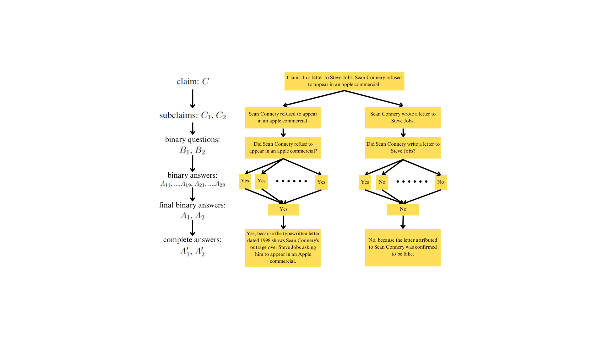

# GProofT: A Multi-dimension Multi-round Fact Checking Framework Based on Claim Fact Extraction

This is the official code and data repository for the [EMNLP 2024 Workshop FEVER AVeriTeC Shared Task](https://fever.ai/) paper:
[GProofT: A Multi-dimension Multi-round Fact Checking Framework Based on Claim Fact Extraction](https://arxiv.org/abs/2401.07286).
**[the url of the paper needs to be updated].**



## 1. Requirements

we use python 3.9.19 which suits all packages

Requirements:
```
spaCy==3.7.5
pandas==2.2.2
openai
transformers==4.20.1
google-auth==2.31.0
```

## 2. GProofT Framework

The code for implementing GProofT framework is [HERE](https://github.com/HKUST-KnowComp/GProofT/blob/main/GPoofT.py).

Replace the following variables with your own ones in the code to execute the fact-checking process:``LOAD_DATA_PATH``, ``OUTPUT_FILE_PATH``, ``AZURE_ENDPOINT``, ``API_VERSION``, ``AZURE_API_KEY``, ``SERVICE_ACCOUNT_FILE``, ``SEARCH_ENGINE_ID``, ``API_KEY``, where ``AZURE_API_KEY`` is the API key to use OpenAI Azure ChatGPT, and ``API_KEY`` is the API key to use Google Search API. The official documents is [HERE](https://developers.google.com/custom-search/v1/overview).

## 3. Verdict Prediction
### 1. Llama_eval.py

This script is used to call large language models like LLaMA3 and LLaMA3-Instruct from Hugging Face to run zero_shot experiment and generate verdicts. For instructions on fine-tuning the model, you can refer to [this repository](https://github.com/hiyouga/LLaMA-Factory).

### 2. GPT_eval.py
GPT_eval.py is used to call OpenAI model using your own API key. Replace the ``azure_endpoint``,``api_version``,``api_key`` to get response from ChatGPT. Replace ``input`` to use your own dataset. 

### 3. Data_Processing

This directory contains code for data processing. It includes scripts to combine the verdict with retrieved evidence and restructure the data to fit a fine-tuning framework. You may use these scripts as needed if they are helpful for your specific tasks.


## 5. Citing this work

Please use the bibtex below for citing our paper: [to be updated]


## 6. Acknowledgement

The authors of this paper were supported by the NSFC Fund (U20B2053) from the NSFC of China, the RIF (R6020-19 and R6021-20), and the GRF (16211520 and 16205322) from RGC of Hong Kong. We also thank the support from the UGC Research Matching Grants (RMGS20EG01-D, RMGS20CR11, RMGS20CR12, RMGS20EG19, RMGS20EG21, RMGS23CR05, RMGS23EG08). 
